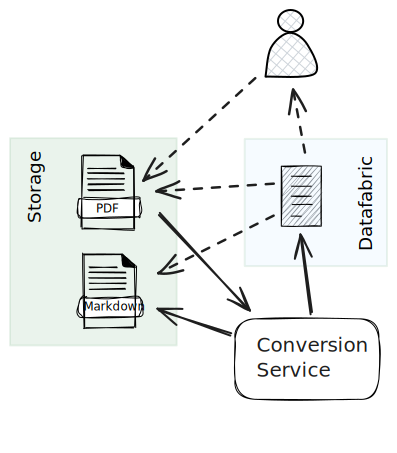

# Tutorial: Working with Artifacts and the Datafabric

> Please note, that this tutorial assumes that you already familiar with
the basics of developing and deploying IVCAP services. If not, you may first
check out the [Building a Gene Ontology (GO) Term Mapper Tool](https://github.com/ivcap-works/gene-onology-term-mapper) tutorial

In this tutorial we will implement a text format conversation service which creates
a Markdown version of a PDF document. Both versions will be stored as IVCAP `artifacts` and
linked together by an IVCAP `aspect`.



More precisely, the service will perform the following steps:

1. Check if there is already a cached conversation of the document, if yes, return that immediately
2. Downloads the source document from IVCAP storage
3. Converts the document using [MarkItDown](https://github.com/microsoft/markitdown) with plugin support
4. Uploads the generated markdown back to IVCAP storage as `artifact`.
5. Returns the URI of the uploaded markdown file (which will be stored as `aspect` in the _DataFabric_)

## Example Output

```bash
% poetry ivcap job-exec tests/request.json -- --timeout 0
...
{
  ...
  "result-content": {
    "$id": "urn:ivcap:artifact:09e0cb8c-d03f-46cd-bc20-5f269d9d0401",
    "$policy": "urn:ivcap:policy:ivcap.base.artifact",
    "$schema": "urn:sd:schema.markdown-conversion.1",
    "markdown_urn": "urn:ivcap:artifact:ea6e74d0-17ce-4947-8022-e038c750c35d"
  },
  "result-content-type": "application/vnd.ivcap.urn:sd:schema.markdown-conversion.1",
  ...
  "status": "succeeded"
}
```

## Implementation - [conversion_service.py](./conversion_service.py)

As usual, we start with declaring the expected request and the reply of the service

```python
class Request(BaseModel):
    SCHEMA: ClassVar[str] = "urn:sd:schema.markdown-conversion.request.2"
    jschema: str = Field(SCHEMA, alias="$schema")
    document: str = Field(description="IVCAP URN of the file to parse")
    policy: Optional[str] = Field("urn:ivcap:policy:ivcap.base.artifact", description="policy for the created markdown artifact")

class Result(BaseModel):
    SCHEMA: ClassVar[str] = "urn:sd:schema.markdown-conversion.1"
    jschema: str = Field(SCHEMA, alias="$schema")
    id: str = Field(..., alias="$id")
    markdown_urn: str = Field(description="URN of the markdown version of the uploaded document.")
    policy: Optional[str] = Field(None, alias="$policy", description="Policy of the created markdown artifact.")
```

As mentioned above the service, implemented by the `conversion_service` method performs the following steps:

1. [Check if there is already a cached conversation of the document, if yes, return that immediately](#step1)
2. [Downloads the source document from IVCAP storage](#step2)
3. [Converts the document using `MarkItDown`](#step3)
4. [Uploads the generated markdown back to IVCAP storage as `artifact`.](#step4)
5. [Return the service result containing the URI of the 'markdown' artifact](#step5)

### Step 1: Check for already existing conversion <a name="step1"></a>

The `ctxt: JobContext`, passed into the service function, contains a reference to an already configured
[IVCAP](https://ivcap-works.github.io/ivcap-client-sdk-python/autoapi/ivcap_client/index.html#ivcap_client.IVCAP) instance reference from the [IVCAP Client SDK](https://ivcap-works.github.io/ivcap-client-sdk-python/index.html).

With it, we can query for a previous result for the requested PDF document (`req.document`). As the result of every job
is being added to the IVCAP **DataFabric** as an `aspect`, we can also try to retrieve it with `ivcap.list_aspects(entity=req.document, schema=Result.SCHEMA, ...)`. If it already exists, we can simply return it.

```python
# 1. Check for cached conversion
ivcap = ctxt.ivcap
cl = list(ivcap.list_aspects(entity=req.document, schema=Result.SCHEMA, limit=1))
cached = cl[0] if cl else None
if cached:
    content = cached.content
    logger.info(f"Using cached document: {content['markdown_urn']}")
    return Result(**content) # should be able to simply return "cached"
```

### Step 2: Downloads the source document from IVCAP storage <a name="step2"></a>


If the requested document has not been converted, or we do not have sufficient permissions to retrieve it, we now need
to first retrieve the respective _artifact_ record for the requested document and then obtain a _file-like_ handle to
its content

```python
# 2. Download the source document
doc = ivcap.get_artifact(req.document)
doc_f = doc.as_file()
```

### Step 3. Converts the document <a name="step3"></a>

After obtaining a reference to the document content, we can call the `convert` function of the
[MarkItDown](https://github.com/microsoft/markitdown) library

```python
# 3. Convert the document to markdown
converter = MarkItDown(enable_plugins=True)
cres = converter.convert(doc_f, stream_info=StreamInfo(mimetype=doc.mime_type))
if not cres:
    raise ValueError(f"Failed to convert document '{req.document}' to markdown.")
md = cres.markdown
```

### Step 4: Uploads the generated markdown back to IVCAP storage as `artifact` <a name="step4"></a>

With the converted markdown text stored in `md`, we can now upload it as an IVCAP _artifact_
with the record details assigned to `cart`.

```python
# 4.Upload the generated markdown to IVCAP storage
ms = io.BytesIO(md.encode("utf-8"))
cart = ivcap.upload_artifact(
    name=f"{doc.name}.md",
    io_stream=ms,
    content_type="text/markdown",
    content_size=len(md),
    policy=req.policy,
)
logger.info(f"Uploaded markdown to {cart.urn}")
```

### Step 5: Return the service result containing the URI of the 'markdown' artifact <a name="step5"></a>

Finally, we create a `Result` instance and return from teh service function. Please note, that
this record is stored as an aspect in the _IVCAP DataFabric_.

> Please note, that we have also defined an `id` field in `Result` with `alias="$id"`. Noramlly
a result is attached as an _aspect_ to the _Job_ record. However, if the result includes an
`$id` field, the result is attached to the entitiy URN identified by that field. In this case,
it is the URN of the source document. Which in turn, allowed us to easily find previous
conversions (see [Step 1](#step1))

```python
# 5. Return the URI of the artifact containing the markdown conversion
result = Result(id=req.document, markdown_urn=cart.urn, policy=req.policy)
return result
```

## Deploying to Platform

> For a more in-depth description, please refer to [Step 8: Deploying to IVCAP](https://github.com/ivcap-works/gene-onology-term-mapper?tab=readme-ov-file#step-8-deploying-to-ivcap-) in the [Gene Ontology (GO) Term Mapper](https://github.com/ivcap-works/gene-onology-term-mapper) tutorial.

Deployment is a three step process:
1. Building and deploying the docker image
1. Registering the service
1. Registering the tool description

All this can be accomplished with a single command:

```
poetry ivcap deploy
```